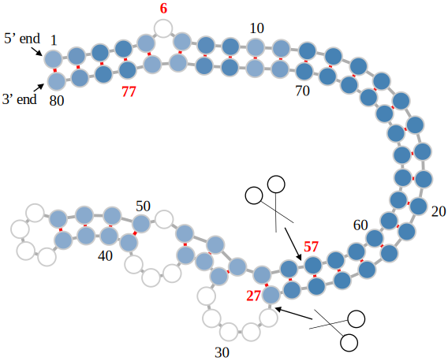
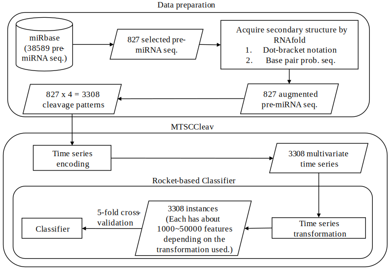

# MTSCCleave: a Multivariate Time Series Classification (MTSC)-based method for predicting human Dicer cleavage sites
<!-- https://stackoverflow.com/questions/39777166/display-pdf-image-in-markdown -->
<!-- for d in *.pdf ; do inkscape --without-gui --file=$d --export-plain-svg=${d%.*}.svg ; done -->

- This figure shows the secondary structure of pre-miRNA "hsa-let-7a-1". The two scissor symbols indicates the two cleavage sites on 5' arm and 3' arm.
    - The colors on the nodes reflect the probability of the base pair in this predicted secondary structure.
    - The 27-28 bond (i.e., the bond between 27th nucleotide and 28th nucleotide) and the 56-57 bond are the cleavage sites.
    - The "scissors" are the human Dicer.



# Notifications
Dates on [AoE](https://www.timeanddate.com/time/zones/aoe) Time Zone
- 2025-07-14 Submitted to [BMC Bioinformatics](https://bmcbioinformatics.biomedcentral.com/).

# Install
```
conda create -n mtsccleav python=3.12
conda activate mtsccleav
pip install sktime
pip install --upgrade numba
pip install matplotlib
pip install seaborn
pip install biopython
# https://viennarna.readthedocs.io/en/latest/api_python.html
python -m pip install viennarna
pip install -U aeon[all_extras]
# If "no matches found" error appears, try below command.
pip install -U aeon"[all_extras]"
```
Other useful commands
```
# Delete the environment if needed.
conda env remove -n mtsccleav
# List the existing environments
conda env list
# Deactivate the environment
conda deactivate
```
# Project Structure
```bash
.
├── code
│   ├── classify_aeon.ipynb # Testing convolution-based classifiers using aeon library
│   ├── classify_sktime.ipynb # Testing convolution-based classifiers using sktime library
│   ├── classify.ipynb
│   ├── interpret.ipynb # Check which part in the multivariate is important for classification
│   ├── mtsccleav.py # General library used for this project
│   ├── prepare_datasets.ipynb # Prepare the miRNA dataset
│   ├── rocket_convolution_ex.ipynb # Convolution examples for Rocket
│   ├── sota
│   │   ├── DiCleave-data # Compare the result with the SOTA, DiCleave
│   ├── transformations.py # time series transformation methods
├── data
├── figures
├── README.md
└── results

.
├── code
│   ├── classify_aeon.ipynb ##
│   ├── classify_sktime.ipynb ##
│   ├── classify.ipynb ##
│   ├── hydra_convolution.ipynb ##
│   ├── interpret.ipynb ##
│   ├── mtsccleav.py ##
│   ├── plot_cd.ipynb ##
│   ├── prepare_datasets.ipynb ##
│   ├── rocket_convolution_examples.ipynb ##
│   ├── sota ##
│   │   ├── DiCleave-data ##
│   │   ├── DiCleave-main ##
│   │   ├── DiCleave-main-e512d74.zip ##
│   │   ├── evaluate_dicleave.ipynb ##
│   ├── test_transformations.ipynb ##
│   └── transformations.py ##
├── data ##
├── figures ##
└── README.md ##
```
# Corresponding paper
## Figures in the paper
# Resources
Other studies related to human Dicer cleavage site prediction (Newest first):
- [DiCleavePlus](https://github.com/MGuard0303/DiCleavePlus)
- [DiCleave](https://github.com/MGuard0303/DiCleave)
- [ReCGBM](https://github.com/ryuu90/ReCGBM)

Some useful time series libraries:
- [sktime](https://www.sktime.net/en/stable/)
- [tslearn](https://tslearn.readthedocs.io/en/stable/)
- [aeon](https://www.aeon-toolkit.org/en/stable/index.html)
- [tsai](https://timeseriesai.github.io/tsai/)
- [pyts](https://pyts.readthedocs.io/en/stable/index.html)
- time series distances
    - [DTAIDistance](https://dtaidistance.readthedocs.io/en/latest/)
- Others
    - [stumpy](https://stumpy.readthedocs.io/en/latest/) (Matrix Profile)
    - [SAX-VSM](https://jmotif.github.io/sax-vsm_site/) (a.k.a. jmotif, in Java)
    
Some biological computation libraries:
- [ViennaRNA](https://viennarna.readthedocs.io/en/latest/index.html)
- [Biopython](https://biopython.org/)

# Pending tasks
1. Upload the datasets to https://timeseriesclassification.com after publication.
1. Make a video (YouTube) presentation.

# Contacts
- It will be updated after paper acceptance.

# MISC
Testing for tsai
```
pip install tsai
# Downgrade fastcore for compatibility with tsai 
pip install fastcore==1.5.29
# Downgrade scikit for compatibility with tsai 
pip install scikit-learn==1.1.3
conda create -n tsai_env python=3.10 -y
conda activate tsai_env
pip install tsai==0.3.6 fastai==2.7.12 fastcore==1.5.29 scikit-learn==1.1.3
pip install --force-reinstall numpy pandas scikit-learn fastai
pip install --force-reinstall fastcore==1.5.29
pip install xgboost
pip install lightgbm
```